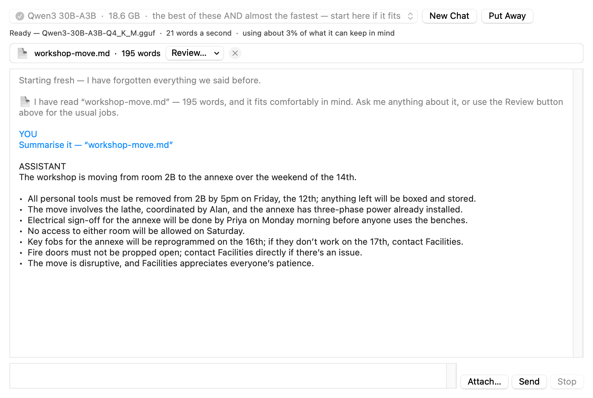
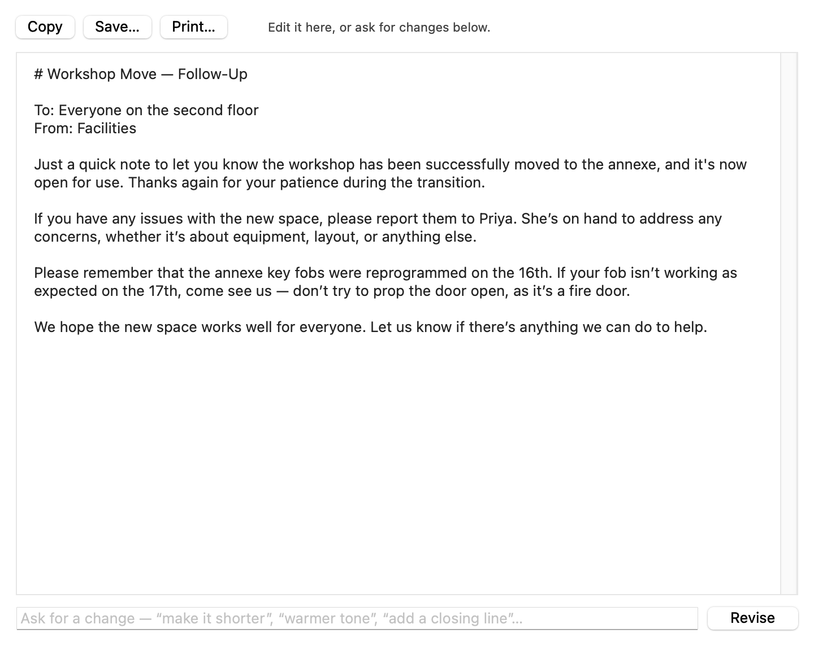
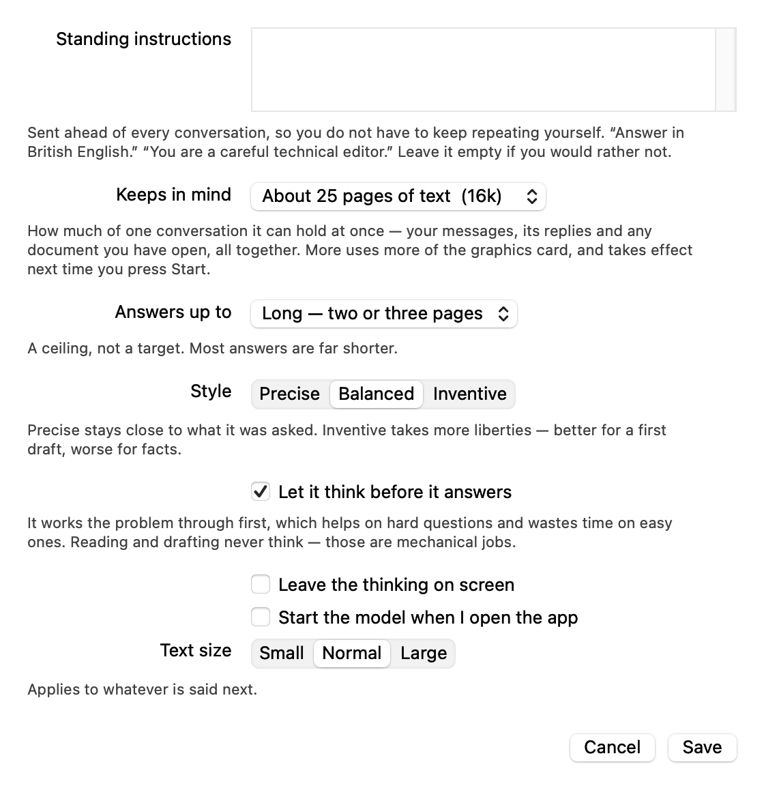

# MacVegaII Chat

**A local AI for the Mac Pro (2019).**

Running AI models on a Mac Pro (2019) has been awkward enough not to be worth the bother,
which made a waste of the Radeon Pro Vega II sitting inside it and its 32 GB of graphics
memory. This app fixes what was in the way. That machine is now supported and tested, with
a set of specific modern models picked and measured for it. The fixes themselves live in
[IntelMacLlamaCpp](https://github.com/albanread/IntelMacLlamaCpp), which has the full
technical detail.

Download a model, press Start, and talk to it. Hand it a document to read, or ask it to
write one. Everything happens on the machine — no account, no sign-in, and nothing you
type or open ever leaves it.

### [⬇︎ Download MacVegaII Chat 0.2.0](https://github.com/albanread/MacProVegaIIChat/releases/latest)

Signed and notarised, about 5 MB. Drag it to Applications and open it — macOS will not
argue with you. The models are downloaded from inside the app, once, and after that it
never needs the internet again.

  

### Scope

Built and tested for one machine and one graphics card: a Mac Pro (2019) with a Radeon
Pro Vega II. Anything else is untested.

## Models

Five are offered, with a tick beside the ones already on this Mac. Speeds are what was
measured on a Radeon Pro Vega II.

| Model | Download | Wants about | Speed |
|---|---|---|---|
| Qwen3 14B `Q4_K_M` | 9.0 GB | 12 GB | — |
| Gemma 4 26B-A4B `QAT UD-Q4_K_XL` | 14.2 GB | 17 GB | 49 tok/s |
| Qwen3 30B-A3B `Q4_K_M` | 18.6 GB | 22 GB | 51 tok/s |
| Qwen3 32B `Q4_K_M` | 19.8 GB | 24 GB | — |
| **Qwen3 30B-A3B `Q6_K`** | 25.1 GB | 27 GB | 47 tok/s |

### Which one should you use?

**Qwen3 30B-A3B Q6_K, if your card has the room. Otherwise the same model at Q4_K_M.**

Those two are the same model at different levels of detail. The Q6_K keeps more of the
original precision, and on this card that turns out to be nearly free: it is a third
larger, but it **reads your documents 17% faster** and its answers are measurably closer
to what the full-sized model would have said, for about 8% off the speed it writes at.

That is backwards from what you would expect, and it is worth knowing because the usual
instinct — take the smaller file, it will be quicker — is wrong here. If the memory is
sitting unused, spend it. The [technical explanation is in the backend
repo](https://github.com/albanread/IntelMacLlamaCpp); the short version is that the
smaller format has to do more unpacking work per byte, and this card has bytes to spare
rather than arithmetic.

**Prefer the mixture-of-experts models** — the two 30B-A3B entries and the Gemma. Only a
fraction of such a model is doing anything at any moment, so they answer about as fast as
a model a tenth of the size while being far better. Both of the plain, dense models in the
list are slower *and* weaker than the 30B-A3B that outweighs them.

**This is what a Vega II buys you.** 32 GB of graphics memory is what lets a 30B model sit
on the card at a decent quantisation. Nothing under about 14B is good enough for the work
this app exists to do — that is not a hedge, it is what the testing showed, and it is why
there is nothing smaller on the list any more.

### Bringing your own

"Use a model file I already have…" at the bottom of the same menu takes any GGUF. It is
**not tested and not recommended.** It ought to work — the chat template, the special
tokens and the reasoning markers all come out of the file, so anything llama.cpp can load
should run, and a new model family needs no change here. But a model can be subtly wrong
in ways that are not obvious from a few replies, and nothing in the app will warn you.
The models in the table above were picked for this card, and the ones with a speed beside
them have been run on it.

If there is a small model you would like tested on this hardware,
[raise an issue](https://github.com/albanread/MacProVegaIIChat/issues). We may eventually
get around to it, and that is the whole of what we can promise.

## Why there is nothing small on the list

These were **user tests, not benchmarks.** The question was a narrow one: could you get
away with a small model? They download in a couple of minutes instead of twenty,
they fit on any card, and they are quick. If one of them could do the work, that would be
worth knowing.

So they were put through this app the way somebody would actually use it, and the answers
were read by hand. None of them are on the list any more, and this is why. If you want perplexity
figures, token throughput and the kernel work underneath, that is all in
[IntelMacLlamaCpp](https://github.com/albanread/IntelMacLlamaCpp) — this page is about
whether a model is any good to use.

Every model was downloaded through the app, loaded onto the card, and asked to do five
things:

- **Work something out.** *Three lathes each need 45 minutes of servicing. Two people work
  at the same time. How long until all three are done?* The answer is 90 minutes. This
  catches a model that gives a confident number with reasoning that contradicts it.
- **Follow a plain instruction.** *Reply with exactly four words and no punctuation.*
  Either it does or it does not.
- **Summarise a real memo** — a page of workshop notices with names, dates and deadlines
  in it.
- **Proofread the same memo**, which has four genuine mistakes in it. The tell here is a
  model that lists a correction identical to the original — `to → to`. That looks like
  work and is not, and it is easy to miss when you are skimming.
- **Admit what it does not know.** The memo says nothing about money, so it is asked what
  the budget is. The right answer is that the document does not say.

That last one matters more than the others. A model that invents a budget will invent
other things, and in an app whose main job is reading your documents, that is the failure
that actually costs you something.

### What happened

| Model | Worked it out | Grounded | Proofreading |
|---|---|---|---|
| Llama 3.2 3B | ✗ said 135 minutes | ✓ "it does not say" | thin, and sometimes lists corrections identical to the original |
| Qwen3 4B | ✗ said 55 minutes, inventing "45 − 35 = 10" | ✓ | **six of seven lines were corrections that corrected nothing** |
| Qwen3 8B | ✗ said 45 minutes, losing a lathe | ✓ | fills the list with "no mistake here" lines, and has been seen repeating one line over and over |
| Qwen3 30B-A3B | — | ✓ | **one line, correct, nothing invented** |

Every small model failed the arithmetic, and each failed differently — 135 minutes, 55
minutes, 45 minutes, where the answer is 90. Every one of them was fluent and confident
about it. None of them invented a budget, which is the one thing they all got right.

The proofreading column is the one to read. A list of corrections where the correction is
the same as the original looks like a model doing its job, and it is the sort of thing you
only catch by reading every line — which is the work you were trying to avoid.

The larger models were not put through the same battery, and there is no plan to. The
exercise was to find out whether a small model could stand in for one, and the answer came
back clearly enough that measuring the obvious would be a waste of the card.

**The honest summary: below about 14B, use it to chat and do not trust it with your
documents.**

## What it does

**Talk to it.** An ordinary chat window. Multi-line input, Return to send, Shift-Return
for a new line. The conversation is trimmed when it outgrows the model's memory, and it
says so when it does.

**Give it a document.** Drop a file on the window, press ⌘O, or drop it on the app icon.
It reads plain text, Markdown, source code, PDF, RTF, Word (.doc/.docx), ODT and HTML.
Then pick a job from the Review menu:

| | |
|---|---|
| Summarise it | one sentence of headline, then the bullets |
| Pull out the key points | in the order they appear, figures and dates intact |
| Review and critique it | what works, what is unclear, what is missing, what to cut |
| Proofread it | one line per mistake, `wrong → right` with context |
| Extract the action items | owner — action — when |
| Explain it simply | plain English, jargon defined |

Or simply ask it questions about the document.

A document that fits in the model's memory is put into the conversation once, so
follow-up questions are ordinary turns and stay fast. **A document that does not fit is
read in passes** — a determinate progress bar shows how many, and a final pass puts the
notes together. It says how long it will be, rather than failing or quietly truncating.

**Have it write one.** ⌘D opens a short panel: what kind of document, what it is for,
tone, length, and whether to draw on the document you have open. The result opens in its
own window where you can edit it, ask for changes in plain English ("make it shorter",
"warmer tone", "add a closing line"), and then Copy, Save as Markdown / plain text / RTF
/ Word, or Print — which is also how you get a PDF on a Mac.

The draft above was written from the memo in the first screenshot — it takes the facts
from it (Priya, the fob dates, the fire door) without reproducing it.

**Settings that explain themselves.** Memory is measured in pages of text rather than
tokens; reply length in pages rather than a token count; sampling temperature is
Precise / Balanced / Inventive. There are standing instructions that go ahead of every
conversation, a switch for whether it thinks before answering, and text size.

**It can be driven by a script.** See [Scripting](SCRIPTING.md).

## Design notes

- **llama.cpp is linked in, not spawned.** It used to run `llama-server` as a child
  process and speak OpenAI-style HTTP to it on the loopback. Linking the library in
  removed every problem that came with owning a second process — no ports, no `/health`
  poll, and no 18 GB engine left resident in VRAM when the app is killed. It also made
  the tokeniser available in-process, so the context meter and the document splitter
  work in real tokens rather than a chars-÷-3 guess. Generation measured slightly faster
  in-process than over HTTP (39.8 vs 32.8 tok/s on the 30B-A3B), and a short reply that
  took 40 s round-trip takes 6 s.
- **The trade accepted.** A fault in the GPU backend now takes the window down with it,
  where before the app survived and offered to restart the engine. That is the real cost
  of binding it in, and it is worth knowing about while the wave64 kernels are still
  being worked on.
- **GPU choice.** `BestMetalDevice()` walks `MTLCopyAllDevices()` and prefers a Metal 3
  device with the most VRAM, then names it in `GGML_METAL_DEVICE` — an environment
  variable added by the fork, read when the Metal device is created.
- **No mmap.** `LLAMA_LOAD_MODE_NONE`, so weights are loaded into VRAM rather than
  mapped. With mmap the GPU reads weights across PCIe and throughput collapses by
  roughly 16×.
- **Prompt cache.** The tokens currently in the KV cache are kept, and a new prompt only
  re-decodes from the first token that differs. That is why a follow-up question answers
  in about a second rather than re-reading the whole conversation.
- **The model's own chat template.** Every GGUF carries the template it was trained
  with, and the app uses it — `common_chat_templates_init(model, "")`, rendered through
  Jinja, with the BOS/EOS strings taken from the vocab. It is never told what format to
  use. That is also where the reasoning markers come from: `<think>` for Qwen3, `[THINK]`
  for Magistral, `<|channel|>analysis<|message|>` for gpt-oss. Nothing about a model
  family is hardcoded here, which is what lets "use a model file I already have" work at
  all. Two consequences the app surfaces rather than hides: a file with no template of
  its own falls back to ChatML and it says so, and a model whose template has no
  reasoning mode is reported as answering straight away instead of silently ignoring the
  thinking setting. The template is also rendered once at load, so one that only breaks
  when used breaks at Start rather than on the user's first message.
- **Reasoning models.** Qwen3 thinks before it answers. The thinking is shown as it
  arrives — otherwise the window sits blank and looks hung — and then folded away to
  "thought for 12 s" once the answer starts. If a model spends its whole reply budget
  thinking and never reaches an answer, the app asks again with thinking turned off
  rather than showing you nothing. Reading and drafting never think: they are mechanical
  jobs, and thinking about them mostly costs time.
- **One copy at a time.** Two instances would mean two models resident, so a second
  launch hands over to the first.

## Supported hardware

One Mac Pro (2019) with a Radeon Pro Vega II, on macOS 26.3. A different Vega II, a
W5700X, a W6800X, a different macOS — all untested. Nobody sends us hardware, so if you
run it on something else, please say what happened.

### The Radeon Pro 580X, and why you want one anyway

A card that reports only **Metal 2 cannot run any of this**. The arithmetic depends on
simdgroup reduction, which these cards expose only via Metal 3, and without it llama.cpp
disables almost every kernel. The Radeon Pro 580X fitted to a great many Mac Pros is one
of these. It will never work as a compute card, and no amount of work on this end changes
that.

**Fit one anyway, and let it drive your screens.** Then the Vega II is doing nothing but
the model — the whole 32 GB, with no framebuffer and no window server taking a slice out
of it. The two-card arrangement is better than one card doing both jobs, not a compromise
on the way to something better.

That is also the cheap way in. A 580X is about the only Mac Pro graphics card still going
on eBay for sensible money, so "cheap card for the display, Vega II for the work" costs
very little to arrange.

The app already knows which is which. Stock llama.cpp takes whichever GPU is driving the
display — on this exact setup, precisely the wrong one, and it fails silently. This app
walks the list itself, picks the Metal 3 card with the most memory, and tells you on
launch if the best card it can find will not do.

## Limitations

- x86_64 only, by design.
- No conversation persistence and no multi-chat. The transcript can be saved as
  Markdown; the conversation itself is not restored on reopening.
- Scanned PDFs with no text layer cannot be read — there is no OCR.

## Building it

See [BUILDING.md](BUILDING.md) if you want to compile it yourself. You do not need to —
the disk image is a finished thing.

## Licence

MIT. Links llama.cpp, also MIT.
